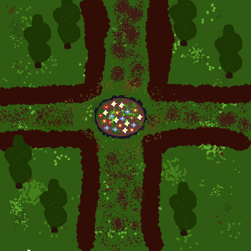

# robot-repair-Oliferuk
## Щоденник розробника
### 18.09.2026 Лаба 2
Створив сцену додав персонажа і намалював тайлмепом та робив простенький біг.
Нічого склданого зовсім не було бо я уже це знав як робити.Лиш  тайл мепом я по іншому раніше працював, створював для нового пензля нову палітру і там я малював не однією клітинкою сцену а робив типу 5 на 5 квадратик і ним замальовував собі сцену.
З розділу **More things to try** я реалізував два пункти:
1. Додав керування через джойстик.
2. Намалював піксельну сцену через Aseprite.

### 04.10.2026 Лаба 3
**Що зроблено:**
* Налаштовано сортування спрайтів за віссю Y (`Custom Axis: X=0, Y=1, Z=0`) та змінено точку опори (Pivot) декорацій і персонажа для реалістичного перекриття об'єктів.
* Створено префаби для декорацій та зон шкоди `DamageZone` з режимом `Tiled`.
* Додано компонент `Rigidbody 2D` персонажу зі скасованою гравітацією (`Gravity Scale = 0`) та зафіксованим поворотом (`Freeze Rotation Z`).
* Перенесено рух персонажа в метод `FixedUpdate` з використанням `rigidbody2d.MovePosition` для усунення тремтіння при зіткненні з перешкодами.
* Налаштовано `Tilemap Collider 2D` та `Composite Collider 2D` (`Merge`, `Static`), а також вимкнено колайдери для тайлів підлоги (`Collider Type = None`).
* Додатково (з розділу «More things to try»): додано розширене розставлення декорацій на карті та створено маршрут із зон шкоди, який змушує гравця маневрувати та обходити небезпечні ділянки.